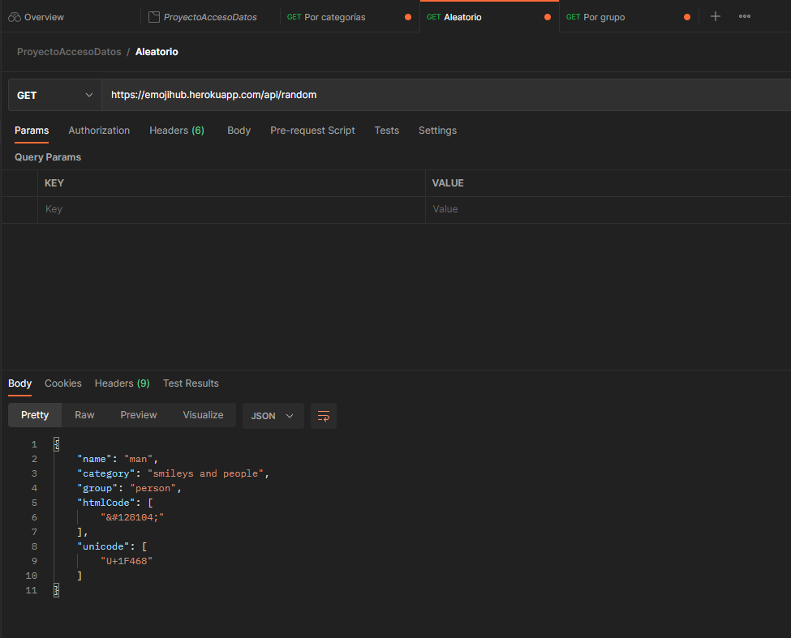
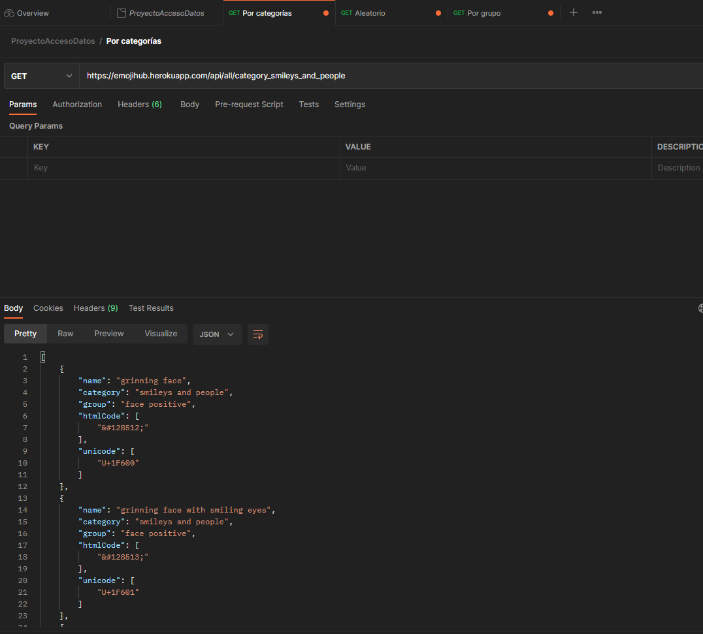
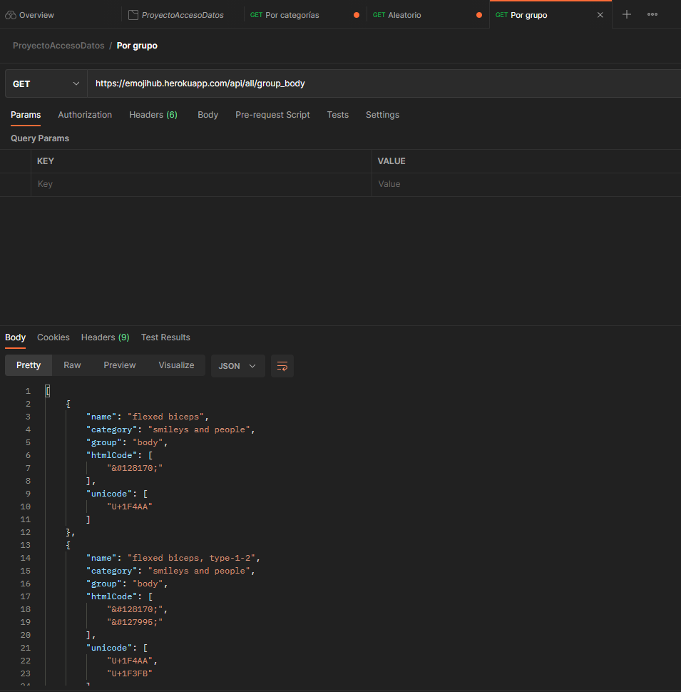

# EMOTICONOS

##  ---» Descripción de la API «--- 

La API escogida ha sido EmojiHub, una API que tiene registro de todos los emoticonos existentes, actualmente, en la Red.
([Aquí dejo la API para posibles consultas.](https://github.com/cheatsnake/emojihub?ref=publicapis.dev))

## ---» Postman «---
Las consultas que se han decidido plasmar en el proyecto han sido la de adquirir un emoticono aleatorio, una lista que corresponda con un grupo y otra lista que corresponda on una categoría.
Dejamos por aquí, bien adjuntadas, unas capturas de postman con las respectivas consultas.

## ---» Manual técnico (desarrolladores) «---
En la carpeta *«controllers»* se hallan la clase *«Controller»* y la clase «Funcion_Guardado», las cuales contienen la inicialización de los combobox, llamamiento de los elementos de la interfaz y los métodos de búsqueda; y los métodos de creación de ficheros (texto, xml, binario y json), respectivamente.
Ésto lo explicamos a detalle a continuación.

### --| Controller |--

También llamado controlador, es el que se encarga del centro de mando. Si el programa fuese un sistema ferroviario, el controlador sse consideraría la torre de control que dirige a los maquinistas.
En este nos encontramos, como primer método, `initialize()` , el cual inicializa los combo box para que el usuario pueda escoger categorías y grupos.
